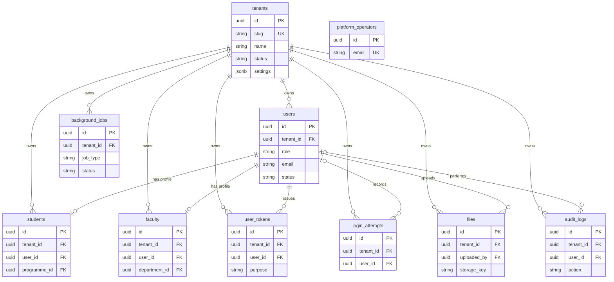
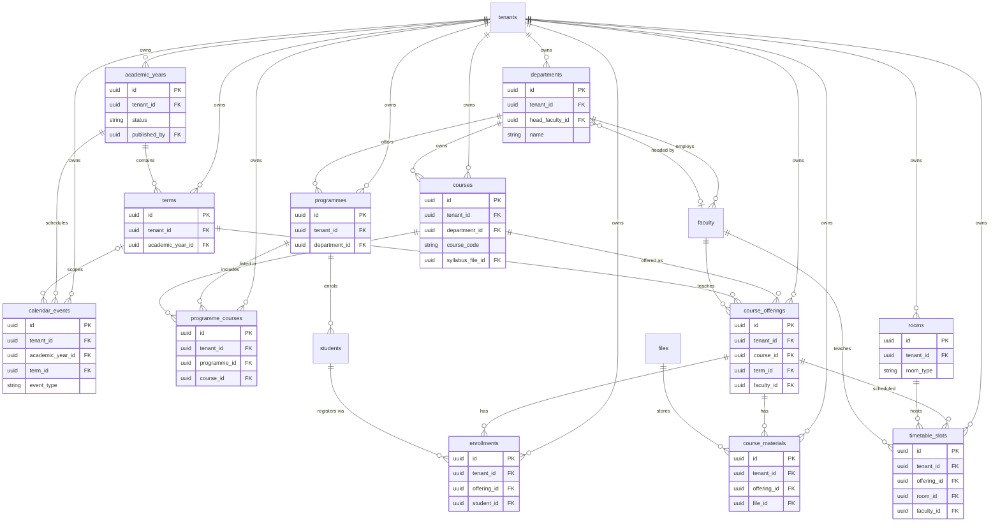
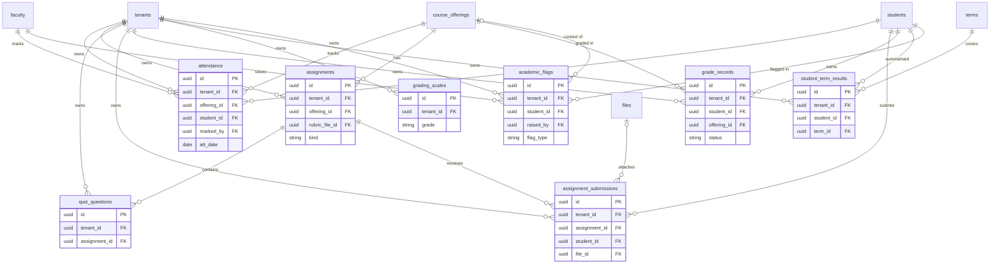
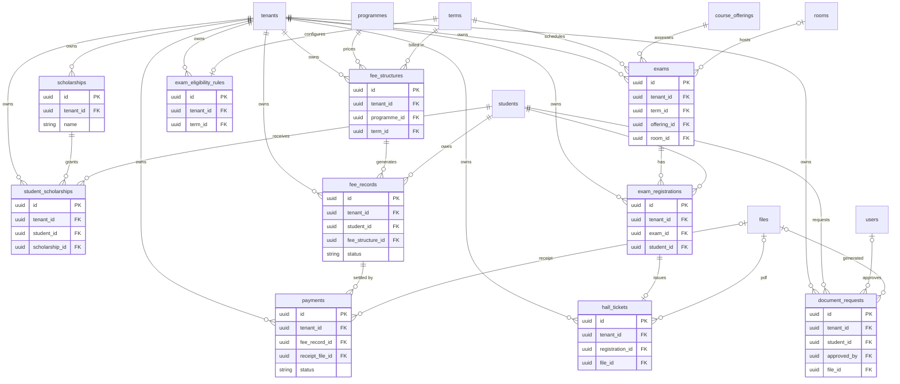
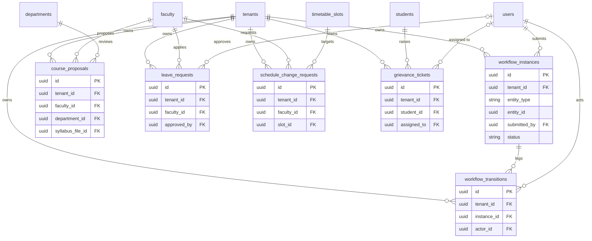
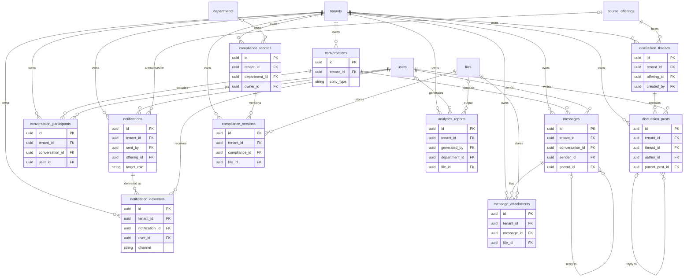

# NEXORA — Multi-Tenant Database Architecture

PostgreSQL 16 · single database · shared schema · row-level isolation by `tenant_id` (Implementation Plan §2).
The model has **57 tables: 55 tenant-scoped, plus `tenants` and `platform_operators`**, which are global. Every tenant-scoped table has a mandatory FK to `tenants`.

## 1. Global Conventions (apply to every tenant-scoped table)

| Rule                 | Detail                                                                                                                                                                                                                                |
| -------------------- | ------------------------------------------------------------------------------------------------------------------------------------------------------------------------------------------------------------------------------------- |
| Primary key          | `id uuid` (UUIDv7, time-ordered for index locality)                                                                                                                                                                                   |
| Tenant link          | `tenant_id uuid NOT NULL REFERENCES tenants(id)` on all 55 tables                                                                                                                                                                     |
| Composite uniqueness | `UNIQUE (tenant_id, id)` on every table, so children use **composite FKs** `(tenant_id, parent_id) → parent(tenant_id, id)`. A row can never point at another college's parent. Diagrams show the single-column form for readability. |
| RLS                  | `ENABLE` + `FORCE ROW LEVEL SECURITY`; policy `tenant_id = current_setting('app.tenant_id')::uuid` (USING and WITH CHECK)                                                                                                             |
| Audit columns        | `created_at`, `updated_at` (`timestamptz`); `created_by` where meaningful (omitted from the tables below)                                                                                                                             |
| Soft delete          | `deleted_at` only on `users`, `students`, `faculty`, `courses`. Grades, fees, documents and audit rows are never hard-deleted.                                                                                                        |
| Indexes              | Every index leads with `tenant_id`, e.g. `(tenant_id, student_id, term_id)`                                                                                                                                                           |
| Files                | No `*_URL` columns. All uploads and generated PDFs are rows in `files`, referenced by `*_file_id`. The PRD's URL fields become file FKs.                                                                                              |
| PRD arrays           | Normalised into junction tables (`courses[]`, `enrolledStudents[]`, `submissions[]`, `readByStudents[]`, `holidays[]`, `examWindows[]`, `events[]`)                                                                                   |
| Money                | `numeric(12,2)`; currency stored in `tenants.settings`                                                                                                                                                                                |
| Workflow status      | Shared enum `DRAFT, SUBMITTED, UNDER_REVIEW, APPROVED, REJECTED, COMPLETED` (PRD §13). Each entity keeps its own `status` column for fast queries; `workflow_transitions` holds the validated history (BR-10).                        |
| Polymorphic refs     | `(entity_type, entity_id)` cannot be a real FK. A trigger verifies the target row has the same `tenant_id`.                                                                                                                           |

## 2. ER Diagrams

Each diagram lists keys and foreign keys only. Full columns are in §3. `tenants` is drawn in every diagram, with a relationship to each tenant-scoped table.

### 2.1 Tenancy, Identity and Platform

### 2.2 Academic Structure and Scheduling

### 2.3 Assessment and Results

### 2.4 Finance, Examinations and Documents

### 2.5 Workflow and Requests

### 2.6 Communication and Governance

9

## 3. Schema Reference

Columns listed exclude `id`, `tenant_id`, `created_at`, `updated_at`, which every tenant-scoped table has. `UQ` = unique constraint, `IX` = index, `CK` = check. Every `UQ`/`IX` shown starts with `tenant_id`.

### 3.1 Tenancy, Identity and Platform

| Table                         | Columns                                                                                                                                                                   | Constraints and indexes                                                                                                                   |
| ----------------------------- | ------------------------------------------------------------------------------------------------------------------------------------------------------------------------- | ----------------------------------------------------------------------------------------------------------------------------------------- |
| `tenants` (global)            | `slug`, `name`, `status` (ACTIVE/SUSPENDED/ARCHIVED), `settings jsonb` (currency, timezone, branding, grading and attendance thresholds), `created_at`                    | `UQ(slug)`. No RLS; readable by the app role for resolution only.                                                                         |
| `platform_operators` (global) | `email`, `password_hash`, `status`, `last_login_at`                                                                                                                       | `UQ(email)`. Separate login, no grants on tenant tables.                                                                                  |
| `users`                       | `role` (ADMIN/FACULTY/STUDENT), `email citext`, `password_hash`, `status` (ACTIVE/INACTIVE/ARCHIVED), `last_login_at`, `failed_login_count`, `locked_until`, `deleted_at` | `UQ(tenant_id,email)`; `IX(tenant_id,role,status)`                                                                                        |
| `user_tokens`                 | `user_id`, `purpose` (REFRESH/PASSWORD_RESET/ACTIVATION), `token_hash`, `expires_at`, `used_at`, `revoked_at`                                                             | `UQ(tenant_id,token_hash)`; `IX(tenant_id,user_id,purpose)`                                                                               |
| `login_attempts`              | `user_id` (nullable), `email`, `success`, `ip_address`, `attempted_at`                                                                                                    | Partition by month; `IX(tenant_id,email,attempted_at)`                                                                                    |
| `students`                    | `user_id`, `programme_id`, `roll_no`, `admission_year`, `current_term_no`, `status`, `deleted_at`                                                                         | `UQ(tenant_id,user_id)`, `UQ(tenant_id,roll_no)`; `IX(tenant_id,programme_id)`                                                            |
| `faculty`                     | `user_id`, `department_id`, `employee_no`, `designation`, `deleted_at`                                                                                                    | `UQ(tenant_id,user_id)`, `UQ(tenant_id,employee_no)`; `IX(tenant_id,department_id)`                                                       |
| `files`                       | `uploaded_by`, `storage_key`, `filename`, `mime_type`, `size_bytes`, `sha256`, `kind`                                                                                     | `UQ(tenant_id,storage_key)`; `storage_key` starts `{tenant_id}/…` (CK)                                                                    |
| `audit_logs`                  | `user_id`, `action`, `entity_type`, `entity_id`, `old_value jsonb`, `new_value jsonb`, `ip_address`, `occurred_at`                                                        | Partition by month; **insert-only** (`REVOKE UPDATE, DELETE`); `IX(tenant_id,entity_type,entity_id)`, `IX(tenant_id,user_id,occurred_at)` |
| `background_jobs`             | `job_type` (REPORT/DOCUMENT/NOTIFY), `payload jsonb`, `status`, `run_at`, `attempts`, `locked_at`, `last_error`                                                           | Worker claims with `FOR UPDATE SKIP LOCKED`; `IX(tenant_id,status,run_at)`                                                                |

### 3.2 Academic Structure and Scheduling

| Table               | Columns                                                                                                                    | Constraints and indexes                                                                                                                           |
| ------------------- | -------------------------------------------------------------------------------------------------------------------------- | ------------------------------------------------------------------------------------------------------------------------------------------------- |
| `departments`       | `name`, `head_faculty_id` (nullable), `budget`, `established_on`                                                           | `UQ(tenant_id,name)`                                                                                                                              |
| `programmes`        | `department_id`, `name`, `duration_terms`, `degree_level`                                                                  | `UQ(tenant_id,name)`                                                                                                                              |
| `academic_years`    | `label` (e.g. 2026-27), `start_date`, `end_date`, `status` (DRAFT/PUBLISHED), `published_by`, `published_at`               | `UQ(tenant_id,label)`; CK `end_date > start_date`                                                                                                 |
| `terms`             | `academic_year_id`, `name`, `term_no`, `start_date`, `end_date`, `enrolment_opens_at`, `enrolment_closes_at`, `is_current` | `UQ(tenant_id,academic_year_id,term_no)`; partial unique on `is_current` per tenant                                                               |
| `calendar_events`   | `academic_year_id`, `term_id` (nullable), `event_type` (HOLIDAY/EXAM_WINDOW/EVENT), `title`, `start_date`, `end_date`      | `IX(tenant_id,academic_year_id,event_type)`. Replaces `holidays[]`, `examWindows[]`, `events[]`.                                                  |
| `courses`           | `department_id`, `course_code`, `title`, `credits`, `syllabus_file_id`, `status`, `deleted_at`                             | `UQ(tenant_id,course_code)`                                                                                                                       |
| `programme_courses` | `programme_id`, `course_id`, `term_no`, `is_mandatory`                                                                     | `UQ(tenant_id,programme_id,course_id)`                                                                                                            |
| `course_offerings`  | `course_id`, `term_id`, `faculty_id`, `section`, `capacity`, `status`                                                      | `UQ(tenant_id,course_id,term_id,section)`; `IX(tenant_id,faculty_id,term_id)`. This is the unit for attendance, grades and timetable.             |
| `enrollments`       | `offering_id`, `student_id`, `status` (ENROLLED/DROPPED/COMPLETED), `enrolled_at`                                          | `UQ(tenant_id,offering_id,student_id)`; `IX(tenant_id,student_id)`                                                                                |
| `course_materials`  | `offering_id`, `file_id`, `title`, `uploaded_by`                                                                           | `IX(tenant_id,offering_id)`                                                                                                                       |
| `rooms`             | `code`, `room_type` (CLASSROOM/LAB), `capacity`, `building`                                                                | `UQ(tenant_id,code)`                                                                                                                              |
| `timetable_slots`   | `offering_id`, `room_id`, `faculty_id`, `day_of_week`, `start_time`, `end_time`                                            | CK `end_time > start_time`; exclusion constraints prevent double-booking a room or a faculty member in overlapping slots within a tenant and term |

### 3.3 Assessment and Results

| Table                    | Columns                                                                                                                                                                                 | Constraints and indexes                                                                                                                                                                                                     |
| ------------------------ | --------------------------------------------------------------------------------------------------------------------------------------------------------------------------------------- | --------------------------------------------------------------------------------------------------------------------------------------------------------------------------------------------------------------------------- |
| `attendance`             | `offering_id`, `student_id`, `att_date`, `status` (PRESENT/ABSENT/LATE/EXCUSED), `marked_by`                                                                                            | `UQ(tenant_id,offering_id,student_id,att_date)`; partition by term or year; `IX(tenant_id,student_id,att_date)`. The student must be enrolled (composite FK to `enrollments`). Attendance % is a view, not a stored column. |
| `assignments`            | `offering_id`, `kind` (ASSIGNMENT/QUIZ), `title`, `description`, `due_at`, `max_marks`, `rubric_file_id`, `status`, `created_by`                                                        | `IX(tenant_id,offering_id,due_at)`                                                                                                                                                                                          |
| `quiz_questions`         | `assignment_id`, `question_text`, `options jsonb`, `correct_answer`, `marks`                                                                                                            | Supports auto-grading (FAC-03)                                                                                                                                                                                              |
| `assignment_submissions` | `assignment_id`, `student_id`, `file_id`, `answers jsonb`, `submitted_at`, `marks`, `feedback`, `graded_by`, `status`                                                                   | `UQ(tenant_id,assignment_id,student_id)`                                                                                                                                                                                    |
| `grade_records`          | `student_id`, `offering_id`, `internal_marks`, `final_marks`, `grade`, `grade_points`, `status` (workflow enum), `submitted_by`, `approved_by`, `published_at`                          | `UQ(tenant_id,student_id,offering_id)`; students may read only `status = COMPLETED AND published_at IS NOT NULL` (BR-04)                                                                                                    |
| `grading_scales`         | `grade`, `min_marks`, `max_marks`, `grade_points`                                                                                                                                       | Per-tenant config; `UQ(tenant_id,grade)`                                                                                                                                                                                    |
| `student_term_results`   | `student_id`, `term_id`, `sgpa`, `cgpa`, `credits_earned`, `published_at`                                                                                                               | `UQ(tenant_id,student_id,term_id)`. CGPA is derived and stored here on publish, not in `grade_records`.                                                                                                                     |
| `academic_flags`         | `student_id`, `offering_id` (nullable), `flag_type` (ATTENDANCE/ACADEMIC/PLAGIARISM/MISCONDUCT/WELFARE/PERFORMANCE), `raised_by`, `description`, `status`, `assigned_to`, `resolved_at` | `IX(tenant_id,student_id,status)`                                                                                                                                                                                           |

### 3.4 Finance, Examinations and Documents

| Table                    | Columns                                                                                                                                                                                         | Constraints and indexes                                                                                        |
| ------------------------ | ----------------------------------------------------------------------------------------------------------------------------------------------------------------------------------------------- | -------------------------------------------------------------------------------------------------------------- |
| `fee_structures`         | `programme_id`, `term_id`, `name`, `amount`, `due_date`                                                                                                                                         | `IX(tenant_id,programme_id,term_id)`                                                                           |
| `scholarships`           | `name`, `kind` (PERCENT/FIXED), `value`, `criteria`                                                                                                                                             | `UQ(tenant_id,name)`                                                                                           |
| `student_scholarships`   | `student_id`, `scholarship_id`, `term_id`, `awarded_at`                                                                                                                                         | `UQ(tenant_id,student_id,scholarship_id,term_id)`                                                              |
| `fee_records`            | `student_id`, `fee_structure_id`, `amount_due`, `discount`, `due_date`, `paid_date`, `status` (PENDING/PAID/OVERDUE/PARTIAL/CANCELLED)                                                          | `IX(tenant_id,student_id,status)`; `IX(tenant_id,due_date)` where `status IN (PENDING,OVERDUE)`                |
| `payments`               | `fee_record_id`, `amount`, `method`, `gateway_ref`, `status` (INITIATED/VERIFIED/FAILED), `verified_at`, `receipt_file_id`                                                                      | `UQ(tenant_id,gateway_ref)` for idempotency; a fee record becomes `PAID` only from `VERIFIED` payments (BR-06) |
| `exams`                  | `term_id`, `offering_id`, `exam_type`, `exam_date`, `start_time`, `end_time`, `room_id`, `max_marks`                                                                                            | `IX(tenant_id,term_id,exam_date)`                                                                              |
| `exam_eligibility_rules` | `term_id`, `min_attendance_pct`, `require_fees_cleared`, `extra_rules jsonb`                                                                                                                    | `UQ(tenant_id,term_id)` (BR-07)                                                                                |
| `exam_registrations`     | `exam_id`, `student_id`, `is_eligible`, `status`, `registered_at`                                                                                                                               | `UQ(tenant_id,exam_id,student_id)`                                                                             |
| `hall_tickets`           | `registration_id`, `file_id`, `ticket_no`, `issued_at`                                                                                                                                          | `UQ(tenant_id,registration_id)`, `UQ(tenant_id,ticket_no)`                                                     |
| `document_requests`      | `student_id`, `doc_type` (BONAFIDE/TRANSCRIPT/GRADE_CARD/TRANSFER_CERTIFICATE/COURSE_COMPLETION/OTHER), `status` (workflow enum), `requested_at`, `approved_by`, `file_id`, `verification_code` | `UQ(tenant_id,verification_code)`; download allowed only when `status = APPROVED` or later (BR-08)             |

### 3.5 Workflow and Requests

| Table                      | Columns                                                                                                                                                                       | Constraints and indexes                                                                           |
| -------------------------- | ----------------------------------------------------------------------------------------------------------------------------------------------------------------------------- | ------------------------------------------------------------------------------------------------- |
| `workflow_instances`       | `entity_type`, `entity_id`, `submitted_by`, `status`, `current_step`, `submitted_at`, `completed_at`                                                                          | `UQ(tenant_id,entity_type,entity_id)`; `IX(tenant_id,status)` for the pending-approvals dashboard |
| `workflow_transitions`     | `instance_id`, `from_status`, `to_status`, `actor_id`, `remarks`, `occurred_at`                                                                                               | Insert-only; the service validates allowed transitions (BR-10)                                    |
| `course_proposals`         | `faculty_id`, `department_id`, `course_title`, `course_code`, `credits`, `description`, `syllabus_file_id`, `status`, `submitted_at`, `reviewed_by`, `reviewed_at`, `remarks` | `IX(tenant_id,status)`                                                                            |
| `leave_requests`           | `faculty_id`, `leave_type`, `start_date`, `end_date`, `reason`, `status`, `approved_by`, `approved_at`, `remarks`                                                             | CK `end_date >= start_date`                                                                       |
| `schedule_change_requests` | `faculty_id`, `slot_id`, `requested_day`, `requested_start`, `requested_end`, `reason`, `status`, `reviewed_by`                                                               | `IX(tenant_id,status)`                                                                            |
| `grievance_tickets`        | `student_id`, `category`, `description`, `status` (OPEN/IN_PROGRESS/WAITING_FOR_RESPONSE/RESOLVED/CLOSED/REJECTED), `assigned_to`, `resolved_at`                              | `IX(tenant_id,status,assigned_to)`                                                                |

### 3.6 Communication and Governance

| Table                       | Columns                                                                                                                              | Constraints and indexes                                                                         |
| --------------------------- | ------------------------------------------------------------------------------------------------------------------------------------ | ----------------------------------------------------------------------------------------------- |
| `notifications`             | `sent_by`, `offering_id` (nullable, for course announcements), `event_type`, `target_role` (nullable), `title`, `message`, `sent_at` | `IX(tenant_id,sent_at)`                                                                         |
| `notification_deliveries`   | `notification_id`, `user_id`, `channel` (IN_APP/EMAIL/SMS/PUSH), `status`, `sent_at`, `read_at`                                      | Partition by month; `IX(tenant_id,user_id,read_at)`. Replaces `readByStudents[]`.               |
| `conversations`             | `conv_type` (DIRECT/GROUP), `title`                                                                                                  | Course discussions use `discussion_threads` instead                                             |
| `conversation_participants` | `conversation_id`, `user_id`, `last_read_at`                                                                                         | `UQ(tenant_id,conversation_id,user_id)`                                                         |
| `messages`                  | `conversation_id`, `sender_id`, `parent_id`, `body`, `search_vector tsvector`, `sent_at`                                             | `IX(tenant_id,conversation_id,sent_at)`; GIN on `(search_vector)` filtered by tenant in queries |
| `message_attachments`       | `message_id`, `file_id`                                                                                                              | `UQ(tenant_id,message_id,file_id)`                                                              |
| `discussion_threads`        | `offering_id`, `title`, `created_by`, `is_locked`                                                                                    | `IX(tenant_id,offering_id)`                                                                     |
| `discussion_posts`          | `thread_id`, `author_id`, `parent_post_id`, `body`, `search_vector`                                                                  | `IX(tenant_id,thread_id,created_at)`                                                            |
| `compliance_records`        | `department_id`, `requirement`, `owner_id`, `submission_date`, `expiry_date`, `status`, `remarks`                                    | `IX(tenant_id,expiry_date)` for expiry alerts                                                   |
| `compliance_versions`       | `compliance_id`, `version_no`, `file_id`, `uploaded_by`                                                                              | `UQ(tenant_id,compliance_id,version_no)`                                                        |
| `analytics_reports`         | `report_type`, `generated_by`, `department_id`, `term_id`, `parameters jsonb`, `status`, `file_id`, `generated_at`                   | Generated through `background_jobs`                                                             |

## 4. Scalability and Isolation Notes

- **Isolation in depth:** `tenant_id` on every row, composite FKs, RLS with `FORCE`, and an app role without `BYPASSRLS`. Cross-tenant references are structurally impossible, not just filtered.
- **Growth tables** (`attendance`, `audit_logs`, `login_attempts`, `notification_deliveries`) are range-partitioned by time. Old partitions can be detached and archived. Audit partitions are kept for the retention period the institution requires.
- **Shard-ready:** because `tenant_id` leads every key and index, a very large college can later be moved to a dedicated database, or the whole schema distributed by `tenant_id` (e.g. Citus), without changing queries.
- **Noisy neighbours:** per-tenant rate limits, a `statement_timeout` on the app role, and keyset pagination on every list endpoint.
- **Analytics:** dashboards read tenant-filtered aggregates. Heavy ones become materialised views or `student_term_results`-style summary tables, refreshed by `background_jobs`. Read replicas can serve reports.
- **Retention:** grades, fees, payments, documents and audit rows are never hard-deleted. Tenant offboarding is an export followed by a batch delete keyed on `tenant_id`.
- **Deliberate deviations from the PRD entity list:** `Course` is split into `courses` (catalogue) and `course_offerings` (per term, with faculty), since attendance, grades and timetables belong to an offering. `CGPA` moves out of `grade_records` into `student_term_results`. `Academic Calendar` is `academic_years` + `terms` + `calendar_events`.
