# NEXORA — Frontend Architecture & UI/UX Specification (`frontend_spec.md`)

**Version:** 1.0.0  
**Target Platform:** Modern Web (Desktop-first, fully responsive mobile/tablet)  
**Framework:** Next.js 15 (App Router) / React 19 + TypeScript  
**Styling & Design System:** Tailwind CSS + shadcn/ui  
**Client State & Caching:** TanStack Query v5 (React Query) + Zustand  
**Animation & Micro-interactions:** ReactBits.dev, Framer Motion, Lucide Icons, Three.js / React Three Fiber  
**Backend API Contract:** Strict 1:1 mapping with FastAPI [`api_spec.md`](file:///c:/Users/DELL/OneDrive/Desktop/NEXORA/api_spec.md) (`/api/v1`)

---

## 1. Executive Summary & Design Philosophy

NEXORA is a high-performance, multi-tenant college operations portal designed for **Administrators**, **Faculty**, and **Students**. The interface merges **academic operational precision** with **futuristic, refined aesthetics**.

### Core UI Pillars:

1. **Brand-Infused Atmosphere:** Inspired by the NEXORA insignia—deep cosmic void backdrops, glowing nebula violet, electric cyan/teal gradients, and crisp typography.
2. **Tactile Micro-Interactions:** Leveraging **ReactBits.dev** components to transform mundane bureaucratic tasks into engaging, tactile experiences (e.g., interactive 3D physics student ID badges, hold-to-confirm grade submission buttons, and 3D floating folder archives).
3. **Information Density & Clarity:** High-density data grids and statistical dashboards balanced with accessible typography, subtle glassmorphism, and distinct status color-coding.
4. **Resilient Data Sync:** Predictable client caching via TanStack Query v5, instant optimistic updates, and strict RBAC screen guards.

---

## 2. Visual Design System & Brand Palette

The NEXORA design token system is derived directly from the official brand mark: deep cosmic obsidian space backgrounds with an energetic swirling vortex of electric cyan, radiant sky blue, and vibrant ultraviolet purple.

```
+---------------------------------------------------------------------------------------+
|                                    NEXORA BRAND SPECTRUM                              |
+-------------------+-------------------+-------------------+---------------------------+
| Cosmic Void (950) | Deep Nebula (900) | Ultraviolet (600) | Electric Cyan (400/500)   |
| #0B0813           | #16102B           | #7C3AED           | #00E5FF / #06B6D4         |
+-------------------+-------------------+-------------------+---------------------------+
```

### 2.1 Color Palette Tokens (Tailwind & CSS Variables)

```css
:root {
  /* Brand Primary: Electric Cyan to Celestial Sky */
  --primary: 187 100% 50%; /* #00E5FF - Electric Cyan */
  --primary-foreground: 222 47% 11%; /* #0B0F19 - Dark Slate Text */
  --primary-hover: 187 92% 43%; /* #00C4DB */
  --primary-glow: 187 100% 50% / 0.25;

  /* Brand Secondary: Deep Cosmic Nebula & Violet */
  --secondary: 263 70% 50%; /* #7C3AED - Ultraviolet */
  --secondary-foreground: 210 40% 98%; /* #F8FAFC */
  --secondary-glow: 263 70% 50% / 0.2;

  /* Accent: Energetic Teal-Emerald for Success & Progression */
  --accent: 168 84% 45%; /* #10B981 - Emerald Accent */
  --accent-foreground: 210 40% 98%;

  /* Dark Mode Surfaces (Default Mode for NEXORA) */
  --background: 260 40% 5%; /* #090611 - Cosmic Void */
  --surface-card: 260 30% 9%; /* #130E22 - Deep Nebula Card */
  --surface-card-hover: 260 28% 13%; /* #1C1533 */
  --surface-glass: 260 30% 9% / 0.75; /* Backdrop Blur Card */
  --border: 260 20% 18%; /* #2A2240 - Subtle Nebula Border */
  --border-focus: 187 100% 50%; /* Electric Cyan Outline */

  /* Neutral Typography */
  --foreground: 210 40% 98%; /* #F8FAFC - Pure White/Frost */
  --muted: 250 15% 20%; /* #2C283B */
  --muted-foreground: 240 10% 65%; /* #9E9AA8 - Secondary Labels */

  /* Semantic Alerts */
  --destructive: 0 84% 60%; /* #EF4444 - Crimson */
  --destructive-foreground: 210 40% 98%;
  --warning: 38 92% 50%; /* #F59E0B - Amber Warning */
  --success: 158 64% 52%; /* #22C55E - Mint Success */
}
```

### 2.2 Typography & Hierarchy

- **Display / Headings:** `Outfit`, sans-serif (Geometric, high-impact, modern tech aesthetic).
- **Body / UI Controls:** `Inter`, sans-serif (Optimized for micro-legibility at 12px–14px).
- **Data Grids & Codes:** `JetBrains Mono`, monospace (Roll numbers, transaction IDs, UUIDs, timestamps).

### 2.3 Glassmorphism & Elevation Specs

- **Floating Header / Navbar:** `backdrop-blur-md bg-[#090611]/80 border-b border-[#2A2240]/60`
- **Widget Cards:** `bg-[#130E22]/70 backdrop-blur-sm border border-[#2A2240]/80 shadow-[0_8px_32px_rgba(0,0,0,0.37)] hover:border-[#00E5FF]/40 transition-all duration-300`
- **Modal Sheets & Dialogs:** `bg-[#0F0B1E] border border-[#3A2D5C] shadow-2xl`

---

## 3. shadcn/ui Component Registry

NEXORA standardizes on `@shadcn/ui` components customized with Tailwind classes matching the brand tokens:

| Component                  | Usage & Context in NEXORA                                         | Customization Notes                                                                          |
| :------------------------- | :---------------------------------------------------------------- | :------------------------------------------------------------------------------------------- |
| `Button`                   | Primary forms, modal triggers, pagination                         | Variants: `default` (Cyan glow), `secondary` (Purple tint), `outline` (Glass), `destructive` |
| `Card` / `CardHeader`      | Course offering cards, timetable slots, stats widgets             | Custom `border-[#2A2240]` with radial gradient hover effect                                  |
| `Table` / `DataTable`      | Attendance register, fee ledgers, audit logs, student directories | Virtualized scroll with `@tanstack/react-table`, column toggling, sortable headers           |
| `Dialog` / `AlertDialog`   | Deleting users, confirming marks submission, paying fees          | Heavy backdrop blur `backdrop-blur-md`                                                       |
| `Sheet` (Slide-over)       | User profile inspector, grievance reply drawer, file detail panel | Slides from right, 480px width on desktop                                                    |
| `Tabs`                     | Admin analytics, course syllabus vs materials, fee terms          | Pill style with active cyan pill indicator                                                   |
| `DropdownMenu`             | Table row actions (`Edit`, `Deactivate`, `View Logs`)             | Dark theme with keyboard navigation shortcuts                                                |
| `Command` / `Combobox`     | Global search (`Cmd+K`), course picker, student selector          | Fuzzy search over users, courses, classrooms                                                 |
| `Badge`                    | Status tags: `ENROLLED`, `DROPPED`, `PAID`, `PENDING`, `APPROVED` | Glow pills (`bg-emerald-500/10 text-emerald-400 border-emerald-500/20`)                      |
| `Calendar`                 | Academic calendar editor, timetable date picker, leave range      | Range selection with marked exam and holiday dots                                            |
| `Form` (`react-hook-form`) | Roster entry, course proposal forms, leave applications           | Integrated with Zod schemas matching FastAPI endpoints                                       |
| `Sonner` (Toaster)         | Action notifications (attendance saved, payment verified)         | Dark glass toasts with cyan/emerald status icons                                             |
| `Progress`                 | Attendance percentage gauge, background job progress              | Dual-tone gradient fill (Cyan to Violet)                                                     |
| `Skeleton`                 | Data fetching state for dashboards and student rosters            | Shimmer animation over `#1C1533` surfaces                                                    |
| `Avatar`                   | Profile pictures with fallback initials and role badge            | Border ring colored by role (Admin: Purple, Faculty: Blue, Student: Cyan)                    |

---

## 4. ReactBits.dev Animation & Interactive Micro-Component Matrix

To elevate the portal from a traditional ERP into a state-of-the-art interactive product, the following **8 ReactBits components** are integrated into designated user touchpoints:

```
+-------------------------------------------------------------------------------------------------------+
|                                    REACTBITS INTEGRATION MAP                                          |
+-----------------------+-----------------------------+-------------------------------------------------+
| Component             | ReactBits Library Link      | Architectural Touchpoint in NEXORA              |
+-----------------------+-----------------------------+-------------------------------------------------+
| 1. LightPillar        | /backgrounds/light-pillar   | Login Hero Canvas & Institution Announcement BG |
| 2. Lanyard (3D Badge) | /components/lanyard         | Interactive 3D Hanging ID Card on Login Screen  |
| 3. ProfileCard        | /components/profile-card    | "My Profile", Faculty Directory, HOD Showcase   |
| 4. FolderFloat        | /micro/folder-float         | Academic Vault (Notes, Syllabus, Hall Tickets)  |
| 5. BellToggle         | /micro/bell-toggle          | Navbar Notification Bell & Preference Toggles   |
| 6. BranchedMenu       | /micro/branched-menu        | Collapsible Multi-Tier Navigation Sidebar       |
| 7. HoldButton         | /micro/hold-button          | Irreversible High-Stakes Action Confirmation    |
| 8. GlassIcons         | /components/glass-icons     | Dashboard Quick-Action Launchpad Grid           |
+-----------------------+-----------------------------+-------------------------------------------------+
```

### 4.1 `LightPillar` (Hero & Visual Backdrops)

- **Library Reference:** `https://reactbits.dev/backgrounds/light-pillar`
- **Implementation:** Rendered behind the **NEXORA Technologies** brand logo on the unauthenticated Login page and the institution-wide Announcement banner.
- **Aesthetic Goal:** Creates an ambient, pulsing volumetric light beacon in deep cyan (`#00E5FF`) and violet (`#7C3AED`) against the obsidian darkness.
- **Props Specification:**
  ```tsx
  <LightPillar
    primaryColor="#00E5FF"
    secondaryColor="#7C3AED"
    density={0.7}
    beamWidth={180}
    speed={0.4}
    interactive={true} // Re-orients subtly with mouse position
  />
  ```

### 4.2 `Lanyard` (Interactive 3D Hanging ID Badge)

- **Library Reference:** `https://reactbits.dev/components/lanyard`
- **Implementation:** Displayed on the right half of the **Login Screen**. When a user types their email, the 3D lanyard badge physics reacts and dynamically flips/renders their previewed ID card (Institution Name, Student Roll No / Faculty Employee No, Photo Avatar, and QR code).
- **Technical Details:** Three.js / React Three Fiber with realistic cloth physics and rope tension.
- **Props Specification:**
  ```tsx
  <Lanyard
    cardData={{
      tenantName: "Apex Institute of Technology",
      name: previewUser.name || "Student / Faculty Identity",
      role: previewUser.role || "MEMBER",
      idNumber: previewUser.code || "APEX-2026-XXXX",
      photoUrl: previewUser.avatarUrl || "/assets/default_avatar.png",
    }}
    gravity={0.8}
    tension={0.9}
  />
  ```

### 4.3 `ProfileCard` (HODs & Student Profiles)

- **Library Reference:** `https://reactbits.dev/components/profile-card`
- **Implementation:**
  1. The top header of **"My Profile"** for all authenticated roles.
  2. The **Faculty Directory** ("Meet the HODs") viewed by Students and Admins.
- **Features:** 3D parallax tilt on hover, holographic foil reflection badge, designation tag, and quick-action contact buttons.

### 4.4 `FolderFloat` (Document Vaults & Study Materials)

- **Library Reference:** `https://reactbits.dev/micro/folder-float`
- **Implementation:**
  - Student & Faculty document sections: Course Materials, Lecture Slides, Syllabi, Rubrics, Payment Receipts, and Compliance Audits.
- **Interaction:** Folders visually float in 3D perspective. Hovering expands the folder tab to reveal a stacked preview of the files within (e.g., `Unit-1_DataStructures.pdf`, `Rubric_Midterm.pdf`).

### 4.5 `BellToggle` (Navbar Bell & Notification Settings)

- **Library Reference:** `https://reactbits.dev/micro/bell-toggle`
- **Implementation:**
  1. Primary **Navbar notification bell icon**: Rings with spring physics when new deliveries arrive from `/api/v1/notifications`.
  2. **Notification settings screen**: Granular toggle switches for muting specific event types (`FEE_DUE`, `ATTENDANCE_WARNING`, `EXAM_REGISTRATION_OPEN`).

### 4.6 `BranchedMenu` (Multi-Tier Navigation Sidebar)

- **Library Reference:** `https://reactbits.dev/micro/branched-menu`
- **Implementation:** Primary application sidebar navigation:
  - `Academics ──┬── Attendance`
  - `           ├── My Timetable`
  - `           └── Course Materials`
  - `Finance ────┬── Fee Invoices`
  - `           └── Payment Receipts`
  - `Exams ──────┬── Schedule & Eligibility`
  - `           └── Hall Tickets`
- **Interaction:** Branching glowing lines animate outward when expanding parent clusters, giving a clean circuit-tree aesthetic.

### 4.7 `HoldButton` (Irreversible High-Stakes Actions)

- **Library Reference:** `https://reactbits.dev/micro/hold-button`
- **Implementation:** Mandatory for high-stakes, irreversible mutations (BR-04, BR-06):
  1. **Faculty:** Final submit of student grade books for approval (`POST /api/v1/faculty/grades/submit-approval`).
  2. **Student:** Final payment confirmation (`POST /api/v1/student/fees/pay`).
  3. **Student:** Exam schedule registration (`POST /api/v1/student/exams/register`).
  4. **Admin:** Deactivating user accounts (`DELETE /api/v1/admin/users/{id}`).
  5. **Admin:** Batch invoicing generation (`POST /api/v1/admin/fee-records/batch-generate`).
- **Interaction:** Requires user to press and hold for **1.5 seconds**. A circular cyan/emerald glow fills the button with haptic or audio feedback before dispatching the mutation. Prevents accidental clicks without annoying native alert popups.

### 4.8 `GlassIcons` (Dashboard Quick-Action Launchpad)

- **Library Reference:** `https://reactbits.dev/components/glass-icons`
- **Implementation:** Displayed at the top of the **Student** and **Faculty** home dashboards:
  - Six floating prism-glass isometric tiles: `[Attendance]`, `[Timetable]`, `[Results]`, `[Fees]`, `[Assignments]`, `[Support]`.
- **Interaction:** 3D refraction effect, custom icon lighting on mouse proximity, and one-click routing to the respective portal view.

---

## 5. Screens & User Flows by Role

```mermaid
flowchart TD
  Login["Login Screen\n(LightPillar + 3D Lanyard)"] --> AuthCheck{"Role Auth Check\n(JWT Claims)"}

  AuthCheck -->|ADMIN| AdminFlow["Admin Portal\n(Institutional Control)"]
  AuthCheck -->|FACULTY| FacultyFlow["Faculty Portal\n(Academic & Grading)"]
  AuthCheck -->|STUDENT| StudentFlow["Student Portal\n(Self-Service Hub)"]

  subgraph AdminPortal ["Admin Workspace"]
    AdminFlow --> AD1["Institutional Dashboard (KPIs)"]
    AdminFlow --> AD2["User Lifecycle & Bulk Ingest"]
    AdminFlow --> AD3["Academic Calendar & Terms"]
    AdminFlow --> AD4["Departments & Facilities Editor"]
    AdminFlow --> AD5["Finance & Scholarship Config"]
    AdminFlow --> AD6["Governance, Approvals & Compliance"]
    AdminFlow --> AD7["Audit Trail Explorer"]
  end

  subgraph FacultyPortal ["Faculty Workspace"]
    FacultyFlow --> FC1["Teaching Dashboard & Schedule"]
    FacultyFlow --> FC2["Course Materials & Syllabi"]
    FacultyFlow --> FC3["Attendance Matrix & Auto-Alerts"]
    FacultyFlow --> FC4["Assignments & Quiz Builder"]
    FacultyFlow --> FC5["Gradebook & Final Submission"]
    FacultyFlow --> FC6["Student Flags & Forum Discussions"]
    FacultyFlow --> FC7["Leave & Timetable Swaps"]
  end

  subgraph StudentPortal ["Student Workspace"]
    StudentFlow --> ST1["Student Command Center (CGPA Trends)"]
    StudentFlow --> ST2["Course Registration & Drops"]
    StudentFlow --> ST3["Timetable & Attendance Gauge"]
    StudentFlow --> ST4["Assignment Hub & Submissions"]
    StudentFlow --> ST5["Fees Ledger & Online Settlement"]
    StudentFlow --> ST6["Exam Registration & Hall Ticket"]
    StudentFlow --> ST7["Support Grievances & Document Vault"]
  end
```



---

### 5.1 Shared Authentication Screen (`/login`)

- **Hero Element:** Ambient `LightPillar` background with the glowing **NEXORA Technologies** insignia centered at the top.
- **Left Column (Form):**
  - Tenant Identifier / College Slug selector (e.g., `Apex Institute` vs `Metropolitan University`).
  - Email input & Password input with reveal toggle.
  - "Remember session" checkbox and "Forgot Password?" trigger.
  - Sign In button with loading spinner state.
- **Right Column (Interactive Lanyard):**
  - Dynamic `Lanyard` 3D physics ID card rendering. As the user enters their institutional email, the card updates with their institutional details and role badge.
- **Error Handling:** 5 failed attempts locks user with a countdown timer banner (423 Locked).

---

### 5.2 Administrator Portal User Flows

#### Screen ADM-1: Institutional KPI Dashboard (`/admin/dashboard`)

- **Header:** Academic Year & Current Term status pill, college code badge, quick global search (`Cmd+K`).
- **KPI Metrics Row:**
  - Total Active Students & Faculty count (`GET /api/v1/admin/analytics/dashboard`).
  - Institutional Average Attendance Rate with progress gauge.
  - Total Fee Revenue Billed vs Collected vs Outstanding.
- **Interactive Charts:**
  - Enrolment trend bar chart grouped by Programme (`GET /api/v1/admin/analytics/enrolments`).
  - Departmental Pass Rate distribution heatmap (`GET /api/v1/admin/analytics/pass-rates`).
- **Quick Action Button:** Export Custom Analytics Report (triggers background job modal).

#### Screen ADM-2: User Directory & Bulk Ingestion (`/admin/users`)

- **Data Table:** Filterable by Role (`ADMIN`, `FACULTY`, `STUDENT`), Department, and Status (`ACTIVE`, `INACTIVE`).
- **Actions:**
  - `+ Add Single User`: Modal with role-specific subforms (Student roll number & admission year vs Faculty designation).
  - `Bulk Roster Ingestion`: Drag-and-drop CSV uploader with live validation preview, submitting to `/api/v1/admin/users/bulk-import`.
  - Row Actions: Edit profile slide-over sheet (`PATCH /api/v1/admin/users/{id}`), or deactivate via `HoldButton` (`DELETE /api/v1/admin/users/{id}`).

#### Screen ADM-3: Academic Structure & Visual Timetable Editor (`/admin/timetable`)

- **Visual Matrix:** 7-day horizontal grid with room rows and time columns (8:00 AM – 6:00 PM).
- **Drag-and-Drop Scheduling:**
  - Drag course offerings into room time slots (`POST /api/v1/admin/timetable/slots`).
  - Live clash detection: Red specular warning ring if faculty or room has an overlapping allocation.
- **Facility Manager Tab:** List rooms, capacities, and laboratory hardware flags (`GET /api/v1/admin/rooms`).

#### Screen ADM-4: Financial Structures & Batch Invoicing (`/admin/finance`)

- **Fee Structure Builder:** Configure programme semester fee components, total tuition, and due dates (`POST /api/v1/admin/fee-structures`).
- **Batch Invoicing Runner:**
  - Select Programme & Term.
  - Pre-computes scholarship deductions from `student_scholarships`.
  - Dispatches batch generation using `HoldButton` (`POST /api/v1/admin/fee-records/batch-generate`).
- **Defaulter Ledger:** Real-time table of overdue accounts with "Send Payment Reminder" broadcast trigger.

#### Screen ADM-5: Governance, Grade Approvals & Compliance (`/admin/approvals`)

- **Final Grade Approvals (BR-04):** List of grade batches submitted by faculty (`POST /api/v1/admin/grading/approval-batches/{id}/review`). View course distribution curve, approve or reject with mandatory review remarks.
- **Faculty Course Proposals (ADM-08):** Review syllabus proposals; approving automatically promotes proposal to active `courses` table.
- **Compliance Document Vault (ADM-09):** `FolderFloat` container holding accreditation files, version histories, and statutory expiry countdowns.

#### Screen ADM-6: Institutional Audit Trail (`/admin/audit-logs`)

- **Log Stream:** Real-time immutable event log (`GET /api/v1/admin/audit-logs`) with filter chips for actor user, action type (`CREATE_USER`, `APPROVE_GRADES`, `AWARD_SCHOLARSHIP`), and JSON diff view (`old_value` vs `new_value`).

---

### 5.3 Faculty Portal User Flows

#### Screen FAC-1: Teaching Command Center (`/faculty/dashboard`)

- **Header:** `ProfileCard` widget showing designation, department, employee number, and office hours.
- **Launchpad:** `GlassIcons` grid (`Attendance`, `Gradebook`, `Assignments`, `My Timetable`, `Flags`, `Leave`).
- **Today's Teaching Schedule:** Real-time timeline of lectures for the current day with room numbers and class count.

#### Screen FAC-2: Attendance Matrix & Risk Flagging (`/faculty/attendance`)

- **Session Selector:** Choose Course Offering, Term, and Date.
- **Bulk Attendance Grid:**
  - List enrolled students with avatars, roll numbers, and historical attendance percentage pills.
  - Quick buttons: `Mark All Present`, `Mark All Absent`.
  - Toggle states: `PRESENT`, `ABSENT`, `LATE`, `EXCUSED`.
  - Submits via `POST /api/v1/faculty/attendance/batch-record`.
  - Automatic Alert: If a student drops below 75%, an animated warning card appears showing that an `AcademicFlag` and student notification have been automatically issued.

#### Screen FAC-3: Course Materials & Study Vault (`/faculty/materials`)

- **Document Explorer:** `FolderFloat` view organized by Course Offering and Unit modules.
- **Upload Trigger:** Direct upload modal utilizing `/api/v1/files/upload` with title, unit number, and description.

#### Screen FAC-4: Assignment & Quiz Studio (`/faculty/assignments`)

- **Assignment Creator:** Title, description, due date, max marks, rubric attachment.
- **Timed Quiz Builder:** Dynamic question list with multiple-choice options, correct answer selection, and per-question mark weights (`POST /api/v1/faculty/quizzes`).
- **Submission Grading Drawer:** Review submitted PDF files side-by-side with rubric, enter score, write feedback, and submit (`POST /api/v1/faculty/submissions/{id}/grade`).

#### Screen FAC-5: Official Gradebook & Final Approval (`/faculty/grades`)

- **Spreadsheet Matrix:** Real-time editable grid with student roll numbers, internal marks, exam marks, calculated total, and letter grade.
- **Submission for Admin Approval:** Final submit guarded by `HoldButton` (`POST /api/v1/faculty/grades/submit-approval`). Once submitted, locks rows with a "Submitted for Review" badge.

#### Screen FAC-6: Operational Requests (`/faculty/requests`)

- **Leave Applications:** Calendar range picker, leave type selection (`CASUAL`, `SICK`, `DUTY`), and status pipeline (`SUBMITTED` → `APPROVED`).
- **Timetable Swap Request:** Select slot, target day/time, reason, and track approval.

---

### 5.4 Student Portal User Flows

#### Screen STU-1: Student Command Center (`/student/dashboard`)

- **Hero Section:** `ProfileCard` displaying student photo, programme, roll number, semester, and current CGPA.
- **Quick Launchpad:** `GlassIcons` tiles linking directly to `My Timetable`, `Attendance Tracker`, `Fee Bills`, `Hall Tickets`, `Assignments`, and `Grievances`.
- **Performance Dashboard (STU-07):**
  - CGPA progression area chart across semesters.
  - Total credits completed tally vs required programme credits.
  - Real-time overall attendance meter with 75% threshold danger indicator.

#### Screen STU-2: Course Registration & Drop Hub (`/student/enrolment`)

- **Enrolment Window Banner:** Active enrollment window countdown timer.
- **Course Catalog (`GET /api/v1/student/courses/available`):**
  - Card list of open courses with credit badges, syllabus download link, faculty instructor name, and remaining seat counter (`Seats: 14/60`).
  - One-click "Add to Cart" registration flow.
- **Active Enrolments:** View currently enrolled courses with "Drop Course" button before deadline.

#### Screen STU-3: Timetable & Attendance Eligibility (`/student/academics`)

- **Weekly Schedule:** Interactive calendar view displaying class timings and classroom numbers (`GET /api/v1/student/timetable`).
- **Course Attendance Breakdown (`GET /api/v1/student/attendance/summary`):**
  - Per-course card showing sessions held, sessions attended, current percentage, and an explicit **Exam Eligibility Badge**:
    - `Eligible (>= 75%)` in glowing mint green.
    - `At Risk (< 75%)` in glowing amber/crimson with calculation of how many consecutive classes must be attended to regain eligibility.

#### Screen STU-4: Assignment & Homework Hub (`/student/assignments`)

- **Tabs:** `Pending Submissions`, `Graded Work`, `Past Due`.
- **Submission Flow:**
  - Drag-and-drop document upload or quiz answer submission (`POST /api/v1/student/assignments/{id}/submit`).
  - View faculty feedback comments and rubric marks breakdown.

#### Screen STU-5: Fee Ledger & Online Settlement (`/student/fees`)

- **Outstanding Dues Card:** Total balance due, scholarship fee waivers applied, and itemized breakdown (`Tuition`, `Lab`, `Library`).
- **Online Settlement (STU-05):**
  - Enter settlement amount and choose payment mode (`UPI`, `Card`, `Net Banking`).
  - Confirmation secured by `HoldButton`.
  - Post-verification: Instant digital receipt generation with downloadable receipt PDF via `/api/v1/student/fees/receipts/{payment_id}`.

#### Screen STU-6: Examination Hub & Hall Ticket Download (`/student/exams`)

- **Upcoming Examinations:** List of scheduled exams with date, time, and room allocation.
- **Eligibility Check (BR-07):** Visual checklist (Attendance >= 75% ✅, Fee Dues Cleared ✅).
- **Hall Ticket Download:** Animated `FolderFloat` container holding verified hall tickets (`GET /api/v1/student/exams/hall-tickets/{exam_id}`) with official verification code and seat number.

#### Screen STU-7: Support Grievances & Official Documents (`/student/services`)

- **Grievance Ticket Desk (STU-08):**
  - File support ticket (`ACADEMIC`, `FINANCE`, `FACILITY`, `EXAMINATION`, `HARASSMENT`).
  - Timeline view of administrative replies and ticket status (`OPEN` → `IN_PROGRESS` → `RESOLVED`).
- **Official Document Requests (STU-09):**
  - Request Bonafide Certificates, Transcripts, Grade Cards, or NOCs.
  - Displays unique verification code (e.g., `DOC-9F2B81`) and download link once status is `COMPLETED`.

#### Screen STU-8: Course Discussions & Direct Faculty Messaging (`/student/messages`)

- **Course Discussion Forum:** Threaded course forums with pinned faculty announcements and peer discussions.
- **Direct Messaging:** Secure 1-on-1 direct message channel to faculty instructors with real-time chat bubbles and document attachments (`POST /api/v1/student/messages/send`).

---

## 6. Technical Integration & Client-Side Caching Strategy

NEXORA adopts **TanStack Query v5** for server-state synchronization paired with **Zustand** for transient client-side UI states.

```
+-----------------------------------------------------------------------------------------------+
|                                TANSTACK QUERY CACHING ARCHITECTURE                            |
+--------------------------+---------------------+-------------------+--------------------------+
| Data Category            | Stale Time (Cache)  | GC Time (Memory)  | Invalidation Triggers    |
+--------------------------+---------------------+-------------------+--------------------------+
| User Profile & Session   | 30 minutes          | 60 minutes        | Profile update, Logout   |
| Academic Years & Terms   | 15 minutes          | 60 minutes        | Term update mutation     |
| Timetables & Schedules   | 10 minutes          | 30 minutes        | Timetable slot mutation  |
| Enrolled Courses         | 5 minutes           | 30 minutes        | Register / Drop course   |
| Attendance Registers     | 2 minutes           | 15 minutes        | Batch attendance save    |
| Fee Ledger & Payments    | 1 minute            | 15 minutes        | Payment verified         |
| Notifications Feed       | 30 seconds          | 5 minutes         | Mark read, Socket event  |
+--------------------------+---------------------+-------------------+--------------------------+
```

### 6.1 Query Key Factory Pattern

All query keys are strictly typed and centralized to prevent stale cache fragmentation:

```typescript
export const queryKeys = {
  auth: {
    me: ["auth", "me"] as const,
  },
  admin: {
    users: (filters?: Record<string, any>) =>
      ["admin", "users", filters] as const,
    user: (id: string) => ["admin", "users", id] as const,
    academicYears: ["admin", "academic-years"] as const,
    departments: ["admin", "departments"] as const,
    analyticsDashboard: ["admin", "analytics", "dashboard"] as const,
    feeStructures: ["admin", "fee-structures"] as const,
    auditLogs: (filters?: Record<string, any>) =>
      ["admin", "audit-logs", filters] as const,
  },
  faculty: {
    schedule: ["faculty", "schedule"] as const,
    materials: (offeringId: string) =>
      ["faculty", "materials", offeringId] as const,
    attendanceRegister: (offeringId: string) =>
      ["faculty", "attendance", offeringId] as const,
    assignments: (offeringId: string) =>
      ["faculty", "assignments", offeringId] as const,
    submissions: (assignmentId: string) =>
      ["faculty", "submissions", assignmentId] as const,
  },
  student: {
    availableCourses: ["student", "courses", "available"] as const,
    timetable: ["student", "timetable"] as const,
    attendanceSummary: ["student", "attendance", "summary"] as const,
    assignments: ["student", "assignments"] as const,
    feesLedger: ["student", "fees", "bills"] as const,
    exams: ["student", "exams", "available"] as const,
    grievances: ["student", "grievances"] as const,
    documents: ["student", "documents"] as const,
  },
  shared: {
    notifications: ["shared", "notifications"] as const,
    job: (jobId: string) => ["shared", "jobs", jobId] as const,
  },
};
```

### 6.2 Optimistic Updates (e.g., Attendance Marking & Notifications)

For instant user feedback, mutations immediately update the cache prior to server response, automatically rolling back if an error occurs:

```typescript
export function useMarkAttendanceMutation(offeringId: string) {
  const queryClient = useQueryClient();

  return useMutation({
    mutationFn: (payload: AttendanceBatchRecordRequest) =>
      apiClient.post("/api/v1/faculty/attendance/batch-record", payload),
    onMutate: async (newRecord) => {
      await queryClient.cancelQueries({
        queryKey: queryKeys.faculty.attendanceRegister(offeringId),
      });
      const previousData = queryClient.getQueryData(
        queryKeys.faculty.attendanceRegister(offeringId),
      );

      // Optimistically update local matrix
      queryClient.setQueryData(
        queryKeys.faculty.attendanceRegister(offeringId),
        (old: any) => {
          return old?.map((student: any) => {
            const match = newRecord.records.find(
              (r) => r.student_id === student.student_id,
            );
            return match ? { ...student, status: match.status } : student;
          });
        },
      );

      return { previousData };
    },
    onError: (err, newRecord, context) => {
      queryClient.setQueryData(
        queryKeys.faculty.attendanceRegister(offeringId),
        context?.previousData,
      );
      toast.error("Failed to save attendance. Changes reverted.");
    },
    onSettled: () => {
      queryClient.invalidateQueries({
        queryKey: queryKeys.faculty.attendanceRegister(offeringId),
      });
    },
  });
}
```

### 6.3 Global Zustand Stores

- **`useAuthStore`:** Stores authenticated access token, current role, and user profile. Automatically injects `Authorization: Bearer <token>` into all HTTP requests.
- **`useTenantStore`:** Stores tenant slug, college branding (colors, logo URL), and regional thresholds (`min_attendance_pct`).
- **`useUIStore`:** Active sidebar expanded state, command palette modal toggle (`Cmd+K`), and unread notification counter.

---

## 7. API Plug-in Matrix (Screens to Backend Routes)

This matrix maps every single UI screen and widget directly to its verified FastAPI backend endpoint:

### 7.1 Authentication & Shared API Points

| UI Screen / Widget         | HTTP Method | Backend Route                     | Query Key / Cache Invalidation             |
| :------------------------- | :---------- | :-------------------------------- | :----------------------------------------- |
| **Login Form**             | `POST`      | `/api/v1/auth/login`              | Sets tokens, sets `useAuthStore`           |
| **Token Refresh**          | `POST`      | `/api/v1/auth/refresh`            | Silent interval refresh                    |
| **User Sign Out**          | `POST`      | `/api/v1/auth/logout`             | Clears all caches (`queryClient.clear()`)  |
| **My Profile Header**      | `GET`       | `/api/v1/auth/me`                 | `['auth', 'me']`                           |
| **Direct File Upload**     | `POST`      | `/api/v1/files/upload`            | Dispatches S3/GCS PUT with presigned URL   |
| **Navbar Bell Feed**       | `GET`       | `/api/v1/notifications`           | `['shared', 'notifications']`              |
| **Mark Notification Read** | `PATCH`     | `/api/v1/notifications/{id}/read` | Invalidates `['shared', 'notifications']`  |
| **Background Job Poller**  | `GET`       | `/api/v1/background-jobs/{id}`    | Polling query with `refetchInterval: 2000` |

### 7.2 Administrator Portal API Points

| UI Screen / Feature    | HTTP Method            | Backend Route                                        | Interaction & Invalidation                |
| :--------------------- | :--------------------- | :--------------------------------------------------- | :---------------------------------------- |
| **Dashboard KPIs**     | `GET`                  | `/api/v1/admin/analytics/dashboard`                  | `['admin', 'analytics', 'dashboard']`     |
| **Enrolment Trends**   | `GET`                  | `/api/v1/admin/analytics/enrolments`                 | `['admin', 'analytics', 'enrolments']`    |
| **Pass Rates Chart**   | `GET`                  | `/api/v1/admin/analytics/pass-rates`                 | `['admin', 'analytics', 'pass-rates']`    |
| **Generate Report**    | `POST`                 | `/api/v1/admin/analytics/reports/generate`           | Starts poller for returned `job_id`       |
| **User Directory**     | `GET`                  | `/api/v1/admin/users`                                | `['admin', 'users', filters]`             |
| **Create User Modal**  | `POST`                 | `/api/v1/admin/users`                                | Invalidates `['admin', 'users']`          |
| **Edit User Sheet**    | `PATCH`                | `/api/v1/admin/users/{id}`                           | Invalidates `['admin', 'users']`          |
| **Deactivate User**    | `DELETE`               | `/api/v1/admin/users/{id}`                           | Invalidates `['admin', 'users']`          |
| **Roster CSV Upload**  | `POST`                 | `/api/v1/admin/users/bulk-import`                    | Starts async worker poller                |
| **Academic Years**     | `GET`, `POST`          | `/api/v1/admin/academic-years`                       | Invalidates `['admin', 'academic-years']` |
| **Terms & Semesters**  | `POST`, `PATCH`        | `/api/v1/admin/terms`, `.../{id}`                    | Invalidates `['admin', 'academic-years']` |
| **Calendar Schedule**  | `GET`, `POST`          | `/api/v1/admin/calendar/events`                      | Invalidates `['admin', 'calendar']`       |
| **Departments**        | `GET`, `POST`, `PATCH` | `/api/v1/admin/departments`                          | Invalidates `['admin', 'departments']`    |
| **Degree Programmes**  | `GET`, `POST`          | `/api/v1/admin/programmes`                           | Invalidates `['admin', 'programmes']`     |
| **Fee Structures**     | `GET`, `POST`          | `/api/v1/admin/fee-structures`                       | Invalidates `['admin', 'fee-structures']` |
| **Batch Invoicing**    | `POST`                 | `/api/v1/admin/fee-records/batch-generate`           | Invalidates `['admin', 'finance']`        |
| **Scholarships Setup** | `POST`                 | `/api/v1/admin/scholarships`                         | Invalidates `['admin', 'scholarships']`   |
| **Award Scholarship**  | `POST`                 | `/api/v1/admin/students/{id}/scholarships`           | Invalidates `['admin', 'finance']`        |
| **Financial Ledger**   | `GET`                  | `/api/v1/admin/finance/collection-summary`           | `['admin', 'finance', 'summary']`         |
| **Facility Rooms**     | `GET`, `POST`          | `/api/v1/admin/rooms`                                | `['admin', 'rooms']`                      |
| **Allocate Timetable** | `POST`                 | `/api/v1/admin/timetable/slots`                      | Invalidates `['admin', 'timetable']`      |
| **Modify Timetable**   | `PATCH`, `DELETE`      | `/api/v1/admin/timetable/slots/{id}`                 | Invalidates `['admin', 'timetable']`      |
| **Broadcast Alerts**   | `POST`                 | `/api/v1/admin/notifications/broadcast`              | Invalidates `['shared', 'notifications']` |
| **Review Proposals**   | `GET`, `POST`          | `/api/v1/admin/course-proposals`                     | Invalidates `['admin', 'proposals']`      |
| **Compliance Vault**   | `GET`, `POST`          | `/api/v1/admin/compliance/records`                   | `FolderFloat` container view              |
| **Grade Approvals**    | `POST`                 | `/api/v1/admin/grading/approval-batches/{id}/review` | Publishes grades to students              |
| **Audit Log Trail**    | `GET`                  | `/api/v1/admin/audit-logs`                           | Immutable stream view                     |

### 7.3 Faculty Portal API Points

| UI Screen / Feature    | HTTP Method             | Backend Route                               | Interaction & Invalidation            |
| :--------------------- | :---------------------- | :------------------------------------------ | :------------------------------------ |
| **Lecture Materials**  | `POST`, `GET`, `DELETE` | `/api/v1/faculty/course-materials`          | `FolderFloat` view for offering files |
| **Attendance Session** | `POST`                  | `/api/v1/faculty/attendance/sessions`       | Sets session topic and metadata       |
| **Bulk Attendance**    | `POST`                  | `/api/v1/faculty/attendance/batch-record`   | Auto-flags students < 75%             |
| **Attendance Sheet**   | `GET`                   | `/api/v1/faculty/courses/{id}/attendance`   | Real-time percentage register         |
| **Create Assignment**  | `POST`                  | `/api/v1/faculty/assignments`               | Broadcasts alert to enrolled students |
| **Course Assignments** | `GET`                   | `/api/v1/faculty/courses/{id}/assignments`  | Lists submission metrics              |
| **Grade Submissions**  | `GET`, `POST`           | `/api/v1/faculty/submissions/{id}/grade`    | Marks with rubric feedback            |
| **Timed Quiz Studio**  | `POST`                  | `/api/v1/faculty/quizzes`                   | Stores question bank & options        |
| **Gradebook Entry**    | `POST`                  | `/api/v1/faculty/grades/batch-entry`        | Saves internal & exam marks           |
| **Submit Approval**    | `POST`                  | `/api/v1/faculty/grades/submit-approval`    | `HoldButton` locks gradebook          |
| **Academic Flags**     | `POST`, `GET`           | `/api/v1/faculty/academic-flags`            | Raises concern tags on students       |
| **Discussion Forum**   | `POST`                  | `/api/v1/faculty/discussions/threads`       | Thread creation & replies             |
| **Teaching Timetable** | `GET`                   | `/api/v1/faculty/timetable/my-schedule`     | Weekly teaching schedule              |
| **Timetable Swap**     | `POST`                  | `/api/v1/faculty/timetable/change-requests` | Workflow request to Admin             |
| **Leave Management**   | `POST`, `GET`           | `/api/v1/faculty/leave/applications`        | Apply & track leave approvals         |
| **Course Proposals**   | `POST`, `GET`           | `/api/v1/faculty/course-proposals`          | Propose syllabus updates              |

### 7.4 Student Portal API Points

| UI Screen / Feature     | HTTP Method   | Backend Route                             | Interaction & Invalidation          |
| :---------------------- | :------------ | :---------------------------------------- | :---------------------------------- |
| **Available Courses**   | `GET`         | `/api/v1/student/courses/available`       | Browse catalog with remaining seats |
| **Course Enrolment**    | `POST`        | `/api/v1/student/enrolments/register`     | Enrols into selected courses        |
| **Drop Course**         | `DELETE`      | `/api/v1/student/enrolments/{id}/drop`    | Drops class with deadline check     |
| **My Timetable**        | `GET`         | `/api/v1/student/timetable`               | Visual calendar schedule            |
| **Attendance Gauge**    | `GET`         | `/api/v1/student/attendance/summary`      | Real-time % & exam eligibility      |
| **Calendar & Holidays** | `GET`         | `/api/v1/student/calendar`                | Academic calendar events            |
| **My Assignments**      | `GET`         | `/api/v1/student/assignments`             | Due dates & graded status           |
| **Submit Assignment**   | `POST`        | `/api/v1/student/assignments/{id}/submit` | Uploads answer document             |
| **Grade Cards**         | `GET`         | `/api/v1/student/grades/term-results`     | Term SGPA/CGPA grade sheets         |
| **Fee Dues Ledger**     | `GET`         | `/api/v1/student/fees/bills`              | Itemized dues & balance             |
| **Fee Settlement**      | `POST`        | `/api/v1/student/fees/pay`                | `HoldButton` payments settlement    |
| **Download Receipt**    | `GET`         | `/api/v1/student/fees/receipts/{id}`      | Official PDF payment receipt        |
| **Eligible Exams**      | `GET`         | `/api/v1/student/exams/available`         | Attendance & fee check list         |
| **Exam Registration**   | `POST`        | `/api/v1/student/exams/register`          | Registers exam schedule             |
| **Hall Ticket PDF**     | `GET`         | `/api/v1/student/exams/hall-tickets/{id}` | `FolderFloat` hall ticket view      |
| **Performance Trends**  | `GET`         | `/api/v1/student/analytics/performance`   | SGPA/CGPA progression charts        |
| **Grievance Support**   | `POST`, `GET` | `/api/v1/student/grievances`              | Raise & track support tickets       |
| **Document Requests**   | `POST`, `GET` | `/api/v1/student/documents/requests`      | Bonafide & transcript issuance      |
| **Discussion Posts**    | `GET`, `POST` | `/api/v1/student/discussions/threads`     | Course peer Q&A threads             |
| **Faculty Chat**        | `POST`        | `/api/v1/student/messages/send`           | In-portal direct messaging          |

---

## 8. Responsive Design & Accessibility (a11y) Standards

1. **Breakpoints:**
   - Mobile: `< 640px` (Bottom drawer navigation, collapsible cards, single-column forms).
   - Tablet: `640px – 1024px` (Collapsible sidebar, two-column dashboards).
   - Desktop: `> 1024px` (Full `BranchedMenu` sidebar, high-density data tables, split-screen grading drawers).
2. **Accessibility (WCAG 2.1 AA):**
   - High-contrast text on all glass cards (minimum 4.5:1 contrast ratio against `#130E22`).
   - Full keyboard navigability over data tables with focus rings in Electric Cyan (`#00E5FF`).
   - Screen-reader labels (`aria-label`) on all icon-only buttons (bell toggles, hold buttons, quick-action tiles).
3. **Optimistic Error Boundaries:**
   - Every major portal section (`/admin`, `/faculty`, `/student`) is wrapped in a dedicated React Error Boundary with an interactive "Retry" trigger.

---

_Verified and mapped strictly against `project_requirements.md`, `database_architecture.md`, `api_spec.md`, and the FastAPI backend implementation._
